

# Overview

This project demonstrates how to deploy a CICD pipeline of a an ML application running in Flask and deployed to Azure Apps. It includes continuous integration with a Github repo where testing and linting is performed, as well as, continuous deployed using Azure Pipelines.

## Project Plan

* [Trello Board](https://trello.com/b/rVxX1sFy/udacity-cicd-project)
* [Project Plan](https://docs.google.com/spreadsheets/d/1gvJu9XE6scDEOVSmdXY8m4HpFsSAvWFCr14_eqi43Uo/edit?usp=sharing)

## Instructions

### Architecture Diagram

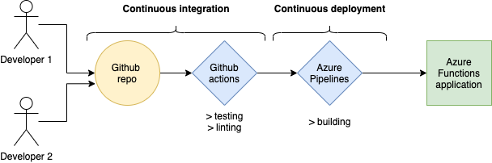

### How To Reproduce

The end goal of this project is to deploy an app in Azure App Service. After a successful deployment you should see the following page after going to your specified app URL:

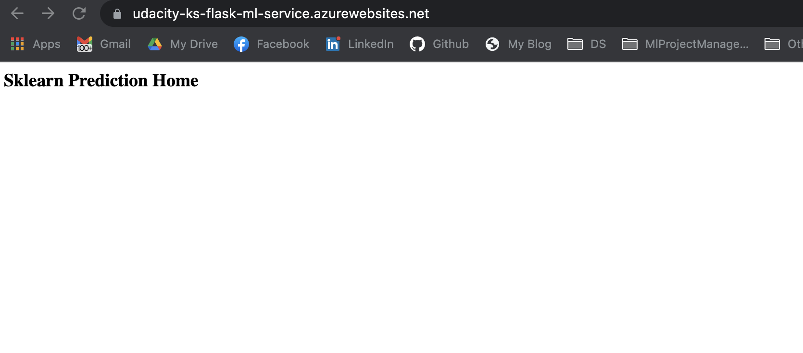

and when invoking the `make_predict_azure_app.sh` in Azure Cloud Shell you should get a predicted value:

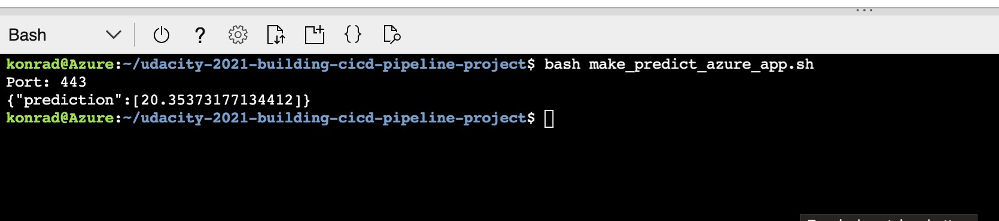

In order to achieve that you should clone the project into the Azure Cloud Shell using ` git clone <REPO_URL>` and deploy your application using `az webapp up -n <APP_NAME>` in your cloned project's root directory.

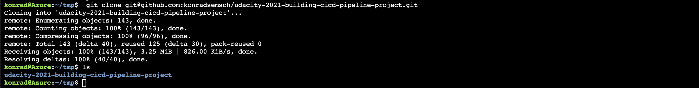

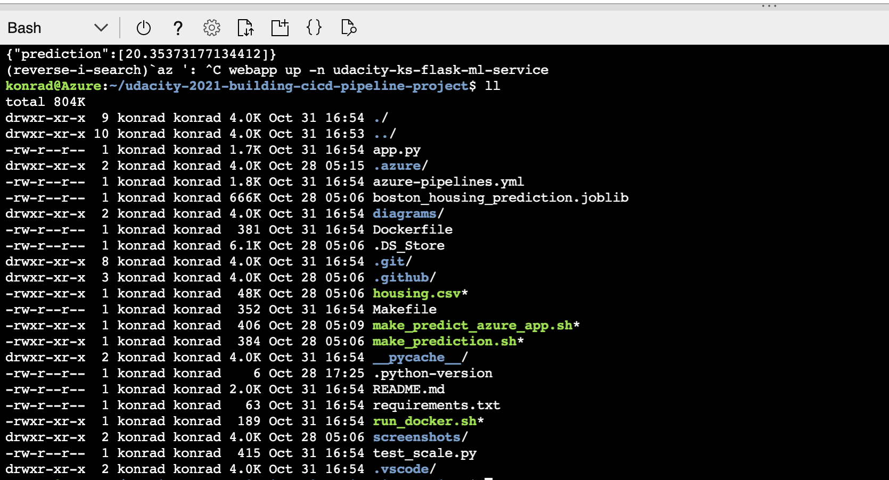

Also, when cloning and running the project locally, you can make use of the `Makefile` in order to create your project's virtual environment. For that run the command: `make setup`.

The next step involves installing all dependencies listed in `requirements.txt` and performing basic linting and unit tests to verify if everything works as expected. For that, you could run the command `make all`, which gives the following output:

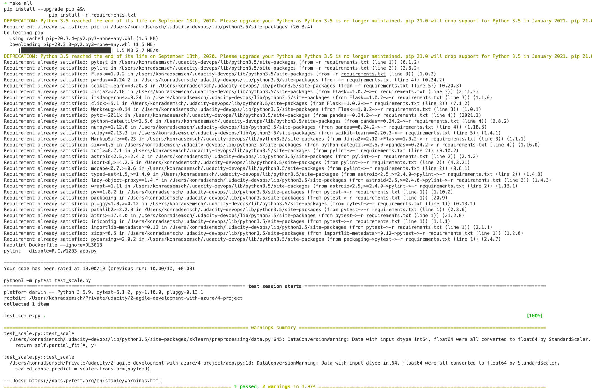

You could also run an individual test by running `pytest test_scale.py` which gives the following output when successful:

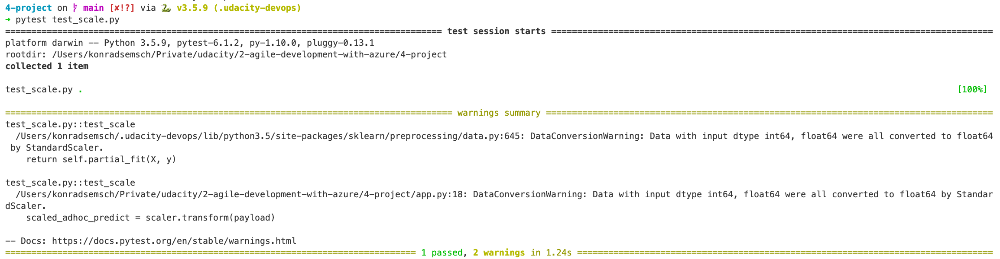

As indicated in the first architecture diagram, this project has an integrated CICD pipeline that uses both `Github Actions`, as well as `Azure Pipelines`. The first one is used for performing Continuous Integration (linting and testing), while the second for Continuous Deployment (deploying the application to Azure). Both pipeline configuration files can be found in `.github/workflows/pythonapp.yml` and `azure-pipelines.yml` respectively.

On each push to the Github repository, an action is triggered and the CI pipelines runs with the following information: 

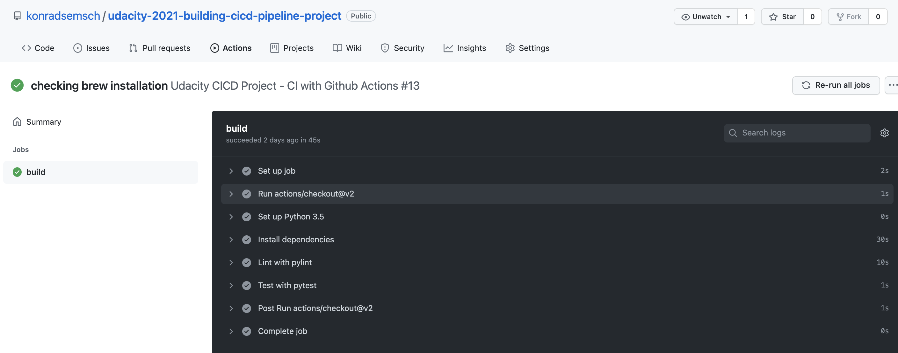

Additionally, Azure Pipeline is triggered and the CD pipelines deploys the application to Azure. For more information check the official Azure documentation: [link](https://docs.microsoft.com/en-us/azure/devops/pipelines/ecosystems/python-webapp?view=azure-devops).

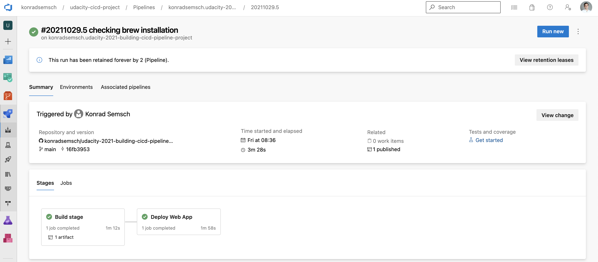

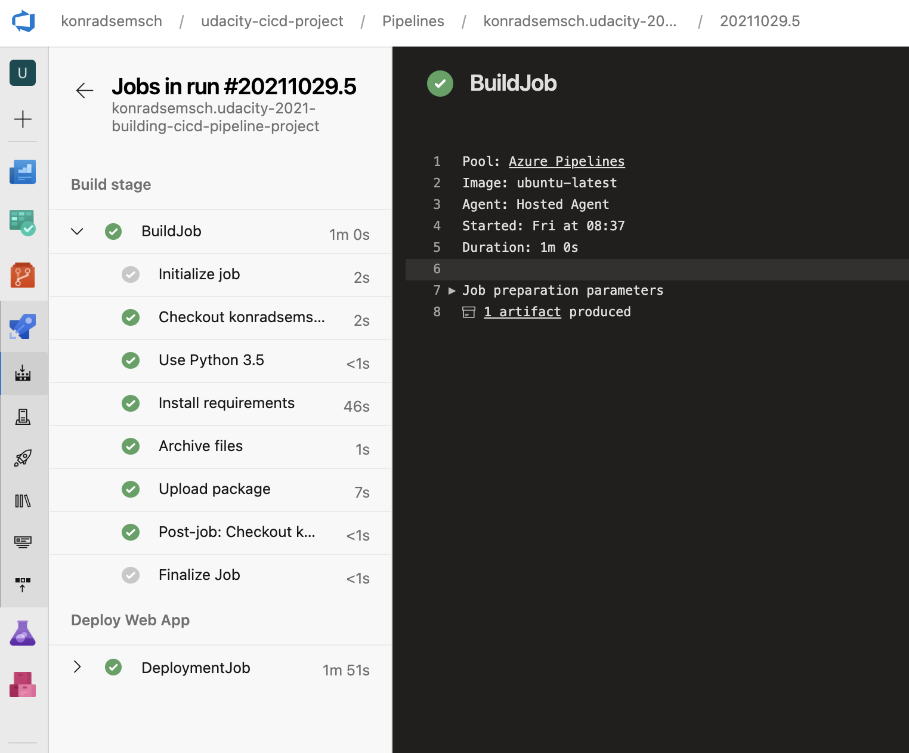

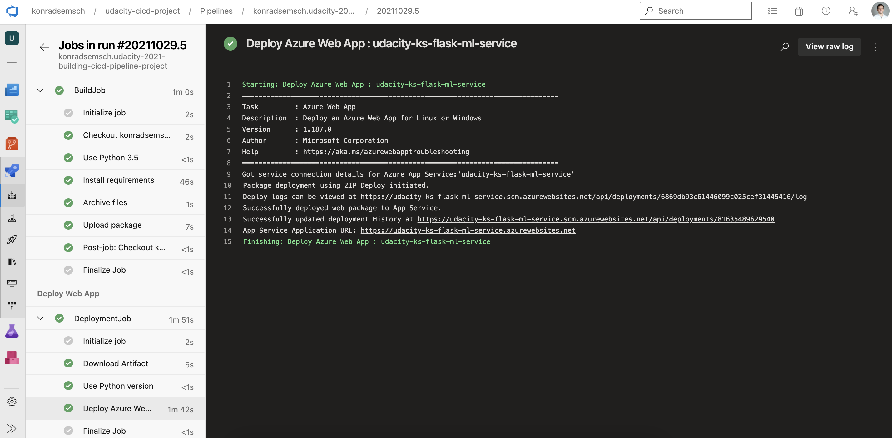

Moreover, you could review your application logs in the Azure Portal to get more detailed information about the app's behavior:

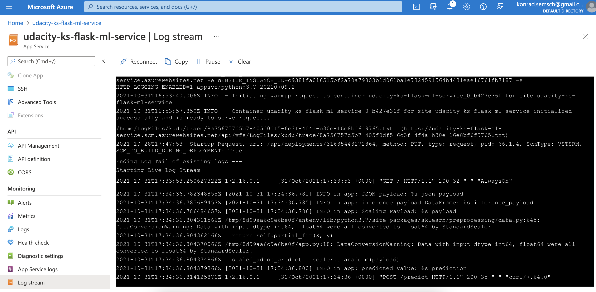

Lastly, you could also loadtest your application by using the `locust` framework for example, which in this case simulates a total of 100 requests made against the API:

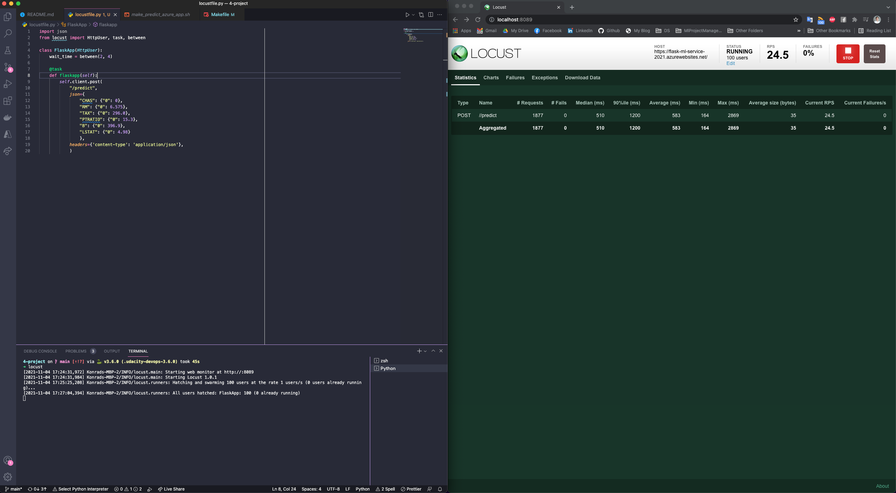
## Enhancements

* write further unit and integration tests
* add further code checks using flake8 and black
* use less managed services from Azure to reduce operational costs

## Demo 

[Video walkthrough of the application](https://youtu.be/aFfR4yUZ8-Q)

